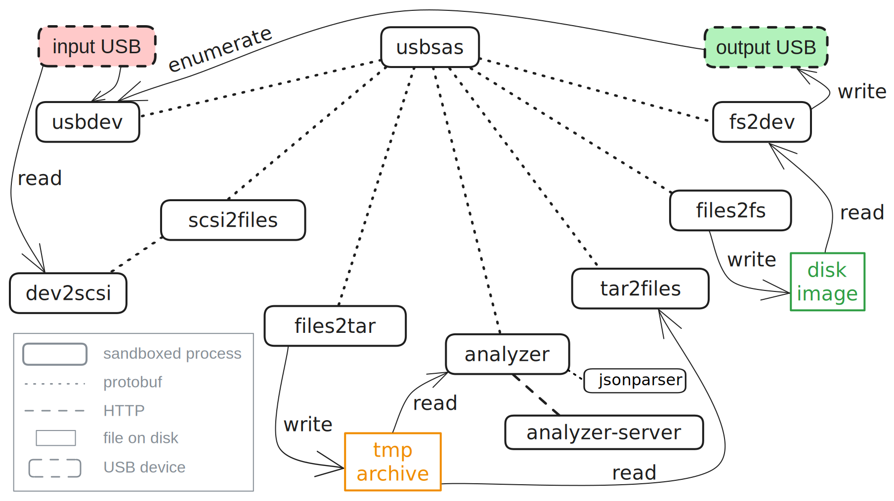

# usbsas architecture

* [Overview](#overview)
* [Communication](#communication)
* [Sandboxing](#sandboxing)
* [Processes](#processes)

## Overview

usbsas is composed of various processes (detailed bellow), each dedicated to a
specific task. The parent process, acting as an orchestrator, is the entry point
for interacting with the framework and building applications.

For example, here are the various processes running in a USB to USB file
transfer:

Processes communicate with each other via `protobuf` serialized data (see
[Communication](#communication)). Processes are tightly sandboxed with `seccomp`
and possibly `landlock` (see [Sandboxing](#sandboxing)).

N.B. All processes aren't shown here, for example, instead of writing files to a
disk image and writing this image on another USB device, usbsas can upload the
intermediary archive to a remote server or execute a custom command to process
data. Also, instead of reading files from a USB device, usbsas can download an
archive from a remote server and write its content to a USB device.

## Communication

Communication between processes is done via two pipes (one for reading, one for
writing), they are created by the parent before the child creation. The
communication model is request-response: messages are exchanged synchronously at
the request of the parent. Data is serialized with `protobuf`.

Messages can be found in `usbsas-proto/proto`.

## Sandboxing

Each process has its own `seccomp` rules. During their initialization phase,
processes open the files they will need later then transition into their secure
state. No messages are parsed before this transition.

If a process can't be sandboxed enough with `seccomp` (if files that will be
opened can't be known in advance for example), filesystem accesses are
restricted to the bare minimum with `landlock`.

See the `usbsas-sandbox` crate for a detailed list of allowed syscalls per
process.

## Processes

Every process is implemented as a state machine, transitioning sequentially from
the `init` state to the `end` state depending of requests received from its
parent. Expected requests depends on the process's state. When the `end` state
is reached, the process exits. All processes are restarted between every
transfer.

#### usbsas
The parent usbsas acts like an orchestrator, spawning and managing every other
processes. It's the process that receives requests from applications using
usbsas (like the GUI or Python module).

#### usbdev

usbdev is responsible for detecting plugged usb mass storage devices and getting
their information. It uses `udev`'s monitor to listen to kernel events.

#### dev2scsi

Opening the input device, reading its partition table and reading sectors is the
job of dev2scsi. It is the only process able to read the input device.

#### scsi2files

scsi2files manages dev2scsi, it is in charge of parsing the file system from the
data it asks dev2scsi to read from the input device. usbsas currently supports
reading `FAT`, `exFAT`, `NTFS`, `ext4` and `ISO9660`.

#### files2tar

files2tar writes files in a tar archive. It can be started in two modes
depending on the transfer destination. If data is copied to another USB device,
files will be stored directly in the tar for analysis. If data is uploaded to a
remote server, files will be stored in the tar under a "/data/" directory and a
"/config.json" file containing information about the input device, hostname etc.
will be added.

#### identificator

This process doesn't do much for now, its future intent will be to identify
users. It currently always answers string ID "Tartempion".

#### analyzer & jsonparser

analyzer uploads a tar containing input files to a remote server for virus
analysis. Remote analysis is enabled in the configuration file.

Results from analysis is expected in JSON format, this data is parsed in a
separate process jsonparser.

#### tar2files

tar2files reads files from a tar archive and its the only file it can read.

#### files2fs

files2fs writes files in a new filesystem with partition table on disk (not on
the destination USB device directly). Supported file systems are `FAT`, `exFAT`
and `NTFS`. The size of the created file system is the size of the destination
USB device. When writing the file system, files2fs will keep track of the (non
empty) sectors actually written in a bit vector, fs2dev will use this bit vector
to avoid writing the whole file system on the destination device.

#### fs2dev

fs2dev writes the file system created by files2fs on the destination USB device.
With files2fs's bit vector, fs2dev will only write non zero sectors on the
target device.

It can also wipe devices (zero are written on all sectors).

#### uploader

This process uploads the tar containing files from the input device to a remote
server.

#### downloader

This process can download a tar containing files from the remote server and
write them on the destination USB device.

#### cmd-exec

Administrators can add other target destination than USB device or remote
network. This is done via the configuration file, a custom command can be
executed with the output tar as argument. Only one custom target is possible for
now.
