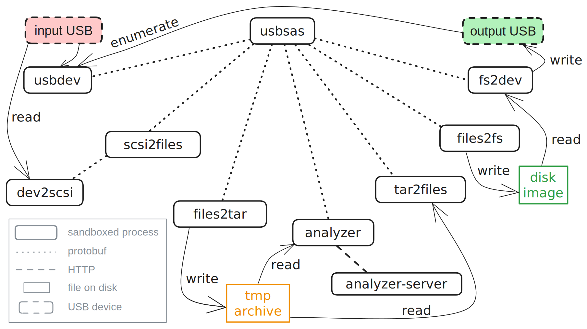

# usbsas architecture

* [Overview](#overview)
  * [Communication](#communication)
  * [Sandboxing](#sandboxing)
  * [Processes](#processes)
* [HID](#hid)

## Overview

usbsas is composed of various processes (detailed bellow), each dedicated to a
specific task. The parent process, acting as an orchestrator, is the entry point
for interacting with the framework and building applications.

For example, here are the various processes running in a USB to USB file
transfer:
<p align="center"></p>

Processes communicate with each other via `protobuf` serialized data (see
[Communication](#communication)). Processes are tightly sandboxed with `seccomp`
and possibly `landlock` (see [Sandboxing](#sandboxing)).

N.B. All processes aren't shown here, for example, instead of writing files to a
disk image and writing this image on another USB device, usbsas can upload the
intermediary archive to a remote server or execute a custom command to process
data. Also, instead of reading files from a USB device, usbsas can download an
archive from a remote server and write its content to a USB device.

### Communication

Communication between processes is done via two pipes (one for reading, one for
writing), they are created by the parent before the child creation. The
communication model is request-response: messages are exchanged synchronously at
the request of the parent. Data is serialized with `protobuf`.

Messages can be found in `usbsas-proto/proto`.

### Sandboxing

Each process has its own `seccomp` rules (apart from the ones doing net stuff
(for now): `analyzer`, `uploader`, `downloader` and `cmdexec`). During their
initialization phase, processes open the files they will need later then
transition into their secure state. No messages are parsed before this
transition.

Common syscalls (allowed for all processes):
- `read()` on the first communication pipe
- `write()` on the second communication pipe, stdout and stderr
- `close()` communication pipes
- `mmap()` with a NULL addr and without the PROT_EXEC flag
- `mremap()` without the PROT_EXEC flag
- `sigaltstack()`
- `munmap()`
- `exit_group()`
- `futex()`
- `brk()`
- `clock_gettime()`
- `rt_sigreturn()`

Other syscalls can be allowed, depending on the tasks of the process, see below.

If a process can't be sandboxed enough with `seccomp` (if files that will be
opened can't be known in advance for example), filesystem accesses are
restricted to the bare minimum with `landlock`.

### Processes

Every process is implemented as a state machine, transitioning sequentially from
the `init` state to the `end` state depending of requests received from its
parent. Expected requests depends on the process's state. When the `end` state
is reached, the process exits. All processes are restarted between every
transfer.

#### usbsas
The parent usbsas acts like an orchestrator, spawning and managing every other
processes. Only usbsas can send requests to its children. usbsas waits for
requests from the final application (like the web client/server or the python
module).

Requests:
see `usbsas-proto/proto/usbsas.proto3`

syscalls: common syscalls; `wait4()`; `getrandom()`; `uname()`

#### usbdev

usbdev is responsible for detecting plugged usb mass storage devices and getting
their information. It uses `udev`'s monitor to listen to kernel events.

Requests: `Devices`

syscalls: common syscalls; `setsockopt()`, `bind()`, `getsockname()`,
`recvfrom()`, `recvmsg()` on udev socket; `epoll_ctl`, `epoll_wait` on a polling
file descriptor;
`mprotect()` without the PROT_EXEC flag; `access()`; `faccessat2()`;
`readlinkat()`; `openat()`; `read()`; `getdents64()`; `fstat()`; `lstat()`;
`statx()`; `fstatfs()`; `newfstatat()`; `close()`;`clock_nanosleep()`;
`getrandom()`

Landlock allowed paths (read only): configuration file path, `/sys/bus`,
`/sys/class`, `/sys/devices`, `/run/udev`.

#### dev2scsi

Opening the input device, reading its partition table and reading sectors is the
job of dev2scsi. It is the only process able to read the input device.

Requests: `OpenDevice`, `ReadSectors`, `ReadPartitions`,

syscalls: common syscalls; `poll()`; some `ioctl()` and `close()` on the device
file descriptor; `read()`, `write()` and `close()` on libusb's event file
descriptor; `timerfd_settime()` and `close()` on libusb's timer file descriptor

#### scsi2files

scsi2files manages dev2scsi, it is in charge of parsing the file system from the
data it asks dev2scsi to read from the input device. usbsas currently supports
reading `FAT`, `exFAT`, `NTFS`, `ext4` and `ISO9660`.

Requests: `OpenDevice`, `ReadSectors`, `ReadPartitions`, `OpenPartition`,
`ReadDir`, `ReadFile`, `GetAttr`

syscalls: common syscalls; `getrandom()`

#### files2tar

files2tar writes files in a tar archive. It can be started in two modes
depending on the transfer destination. If data is copied to another USB device,
files will be stored directly in the tar for analysis. If data is uploaded to a
remote server, files will be stored in the tar under a "/data/" directory and a
"/config.json" file containing information about the input device, hostname etc.
will be added.

Requests: `NewFile`, `WriteFile`, `EndFile`, `Close`

syscalls: common syscalls; `write()`, `lseek()` and `close()` on the tar file
descriptor

#### identificator

This process doesn't do much for now, its future intent will be to identify
users. It currently always answers string ID "Tartempion".

Requests: `Id`

syscalls: common syscalls

#### analyzer

analyzer uploads a tar containing input files to a remote server for virus
analysis. Remote analysis is enabled if `usbsas` was started with the `--analyze`
flag and if a URL is specified in the configuration file.

File is first POSTed to "URL/[user_id]", the server should respond a unique
analysis identifier. Then analyzer will poll the remote server on
"URL/[user_id]/[analyze_id]". The expected answer from the server is a JSON
containing a status string, when the analysis is done, status should be "scanned"
and the JSON response should include sanity status for all files, for example:

```json
{
  "status": "scanned",
  "id": "f092fb9a883b439eaf5c6e75bcdc646e",
  "files": {
    "SCSI Commands Reference Manual.pdf": {
      "status": "CLEAN",
      "sha256": "XXX"
    },
    "directories/a/man_rustc.txt": {
      "status": "CLEAN",
      "sha256": "XXX"
    },
    "eicar.com": {
      "status": "DIRTY",
      "sha256": "XXX"
    }
  },
  "antivirus": {
    "ClamAV": {
        "version": "XXX",
        "database_version": "XXX",
        "database_timestamp": "XXX"
    }
  }
}
```

This report can be written on the destination device (if enabled in the
configuration file).

It supports Kerberos mutual authentication if compiled with the `authkrb`
feature (enabled by default) and a service name is present in the configuration
file.

Requests: `Analyze`

syscalls: analyzer doesn't run in a seccomp sandbox (for now ? many are needed
because of network and kerberos authentication) but its filesystem accesses are
restricted with landlock.

#### analyzer-server

This server analyzes files (received in a tar) with [Clam
AntiVirus](https://en.wikipedia.org/wiki/Clam_AntiVirus).

analyzer-server included in this project is mainly given as example, using only
`clamav` for file analysis isn't recommended. Solutions with multiple antivirus
like [Irma](https://irma-oss.quarkslab.com/) or
[VirusTotal](https://en.wikipedia.org/wiki/VirusTotal) should be preferred.

#### tar2files

tar2files reads files from a tar archive.

Request: `ReadDir`, `GetAttr`, `ReadFile`

syscalls: common syscalls; `read()`, `lseek()` and `close()` on tar file
descriptor, `getrandom()`

#### files2fs

files2fs writes files in a new filesystem with partition table on disk (not on
the destination USB device directly, that's fs2dev's job). Supported file
systems are `FAT`, `exFAT` and `NTFS`. The size of the created file system is
the size of the destination USB device. When writing the file system, files2fs
will keep track of the (non empty) sectors actually written in a bit vector,
fs2dev will use this bit vector to avoid writing the whole file system on the
destination device.

Requests: `SetFsInfos`, `NewFile`, `WriteFile`, `EndFile`, `Close`, `BitVec`,
`ImgDisk`, `WriteData`

syscalls: common syscalls; `read()`, `write()` `lseek()` and `close()` on fs
file descriptor

#### fs2dev

fs2dev writes the file system created by files2fs on the destination USB device.
With files2fs's bit vector, fs2dev will only write non zero sectors on the
target device.

It can also wipe devices (zero are written on all sectors).

Requests: `DevSize`, `StartCopy`, `Wipe`, `LoadBitVec`

syscalls: common syscalls; `write()`, `lseek()`, `close()` and some `ioctl()` on
fs file descriptor; `poll()`

#### uploader

This process uploads the tar containing files from the input device on a remote
server. It is done with a HTTP POST request to the URL specified in the
configuration file, to which is added the identification string (e.g.
`http///127.0.0.1/api/uploadbundle/{ID}`)

It supports Kerberos mutual authentication if compiled with the `authkrb`
feature (enabled by default) and a service name is present in the configuration
file.

Requests: `Upload`

uploader doesn't run in a seccomp sandbox but its filesystem accesses
are restricted with landlock.

#### downloader

This process can download a tar containing files from the remote server and
write them on the destination USB device.

It supports Kerberos mutual authentication if compiled with the `authkrb`
feature (enabled by default) and a service name is present in the configuration
file.

Requests: `Download`, `ArchiveInfos`

downloader doesn't run in a seccomp sandbox but its filesystem accesses are
restricted with landlock.

#### cmd-exec

Administrators can add other target destination than USB device or remote
network. This is done via the configuration file, a custom command can be
executed with the output tar as argument. Only one custom target is possible for
now.

A custom command can also be executed after any transfer, with (depending on the
destination) the output tar or filesystem as argument.

Requests: `Exec`, `PostCopyExec`

syscall: cmdexec doesn't run in a seccomp sandbox

## HID

In order to protect against BadUSB devices, a minimal HID driver has also been
implemented. It runs in user space (`hid` kernel modules aren't used) and only
supports mouse left clicks (enough for selecting files to transfer), keystrokes
sent by a malicious device (or any keyboard) won't be handled by the system.
