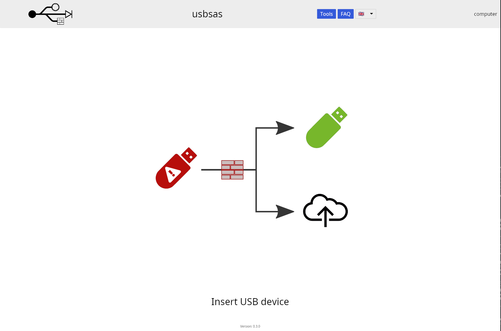

# usbsas kiosk

usbsas is meant to be deployed as a kiosk station. Here is a guide to do it
based on a fresh Debian installation (everything as default, no desktop
environment).

Debian packages (for x86_64) can be downloaded from the [realease
page](https://github.com/cea-sec/usbsas/releases/latest) or built with the
following instructions.

## Build the Debian packages

The generated packages will be located in `target/debian`.

### Install the dependencies
```shell
$ sudo apt install -y --no-install-recommends curl pkgconf clang cmake git
$ curl --proto '=https' --tlsv1.2 -sSf https://sh.rustup.rs | sh -s -- -y
$ source $HOME/.cargo/env
$ cargo install cargo-deb
```

### Clone usbsas
```shell
$ git clone https://github.com/cea-sec/usbsas
$ cd usbsas
```

### Set environment variables
```shell
$ export USBSAS_WEBFILES_DIR="/usr/share/usbsas/web"
$ export USBSAS_BIN_PATH="/usr/libexec"
```

### usbsas-server
```shell
$ sudo apt install -y --no-install-recommends libssl-dev libkrb5-dev libseccomp-dev libusb-1.0-0-dev
$ cargo build --release
$ cargo-deb --manifest-path=usbsas-server/Cargo.toml --no-build
```

The `usbsas-server` package contains usbsas and the web server. It will add a
new user `usbsas` and a udev rule giving it ownership of plugged USB devices.
`uas` and `usb_storage` kernel modules are prevented from loading with a
modprobe configuration file.

### usbsas-analyzer-server
```shell
$ sudo apt install -y --no-install-recommends libclamav-dev
$ cargo build --release --manifest-path=usbsas-analyzer-server/Cargo.toml
$ cargo-deb --manifest-path=usbsas-analyzer-server/Cargo.toml --no-build
```

The `usbsas-analyzer-server` package contains the analyzer server. It will
install clamav-freshclam as a dependency to download clamav database.

### usbsas-kiosk
```shell
$ make -C client/kiosk
```

The `usbsas-kiosk` package contains `nwjs` and a script meant to be started by
xinit at boot. It will add a `usbsas-client` user. The systemd service,
when enabled, will automatically log in the `usbsas-client` and start the
application.

### usbsas-hid
```shell
$ sudo apt install -y --no-install-recommends libdbus-1-dev libxtst-dev libx11-dev
$ cargo build --release --manifest-path=usbsas-hid/hid-user/Cargo.toml
$ cargo build --release --manifest-path=usbsas-hid/hid-dealer/Cargo.toml
$ cargo-deb --manifest-path=usbsas-hid/hid-dealer/Cargo.toml --no-build
```

The `usbsas-hid` package contains a minimal HID manager running in user space,
it only supports mouse left click (no keyboard). `hid` kernel modules are
prevented from loading with a modprobde configuration file. A udev rule will
give ownership of HID devices to `usbsas-client` when plugged and start the HID
manager. The installation of `usbsas-hid` is recommended but not mandatory.

## Install the Debian packages

```shell
$ sudo apt install ./usbsas-server_0.1.0_amd64.deb \
                   ./usbsas-analyzer-server_0.1.0_amd64.deb \
                   ./usbsas-kiosk_0.1.0_amd64.deb \
                   ./usbsas-hid_0.1.0_amd64.deb
```


After installation, systemd services must be enabled and a reboot is needed.

/!\ Warning: Once the system has rebooted, the only displayed application will
be nwjs and since keyboards will be disabled (if usbsas-hid is installed), it is
a good idea to keep an access (ssh for example) to the machine.

```shell
sudo systemctl enable usbsas-server.service
sudo systemctl enable usbsas-analyzer-server.service
sudo systemctl enable usbsas-client.service
sudo reboot
```

nwjs client:

<p align="center"></p>

## Hardening

XXX TODO
