# Usbsas graphical interface usage

### Welcome screen

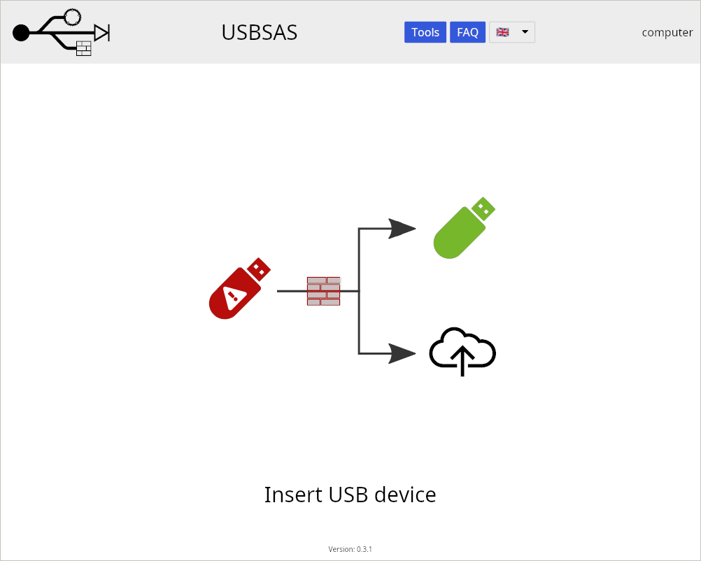

---

### At least one USB device has been plugged

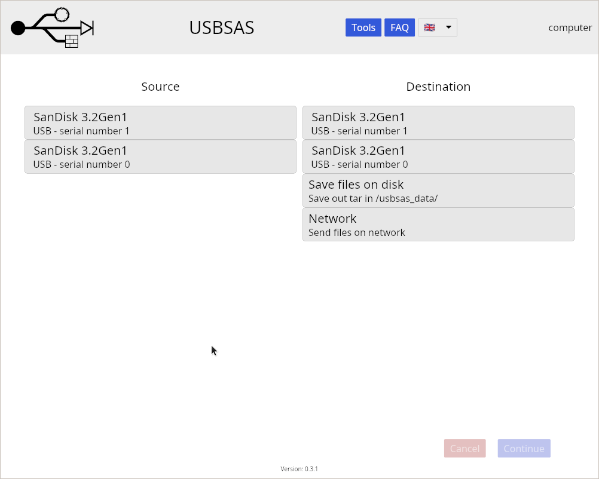

---

### Input and output device selection

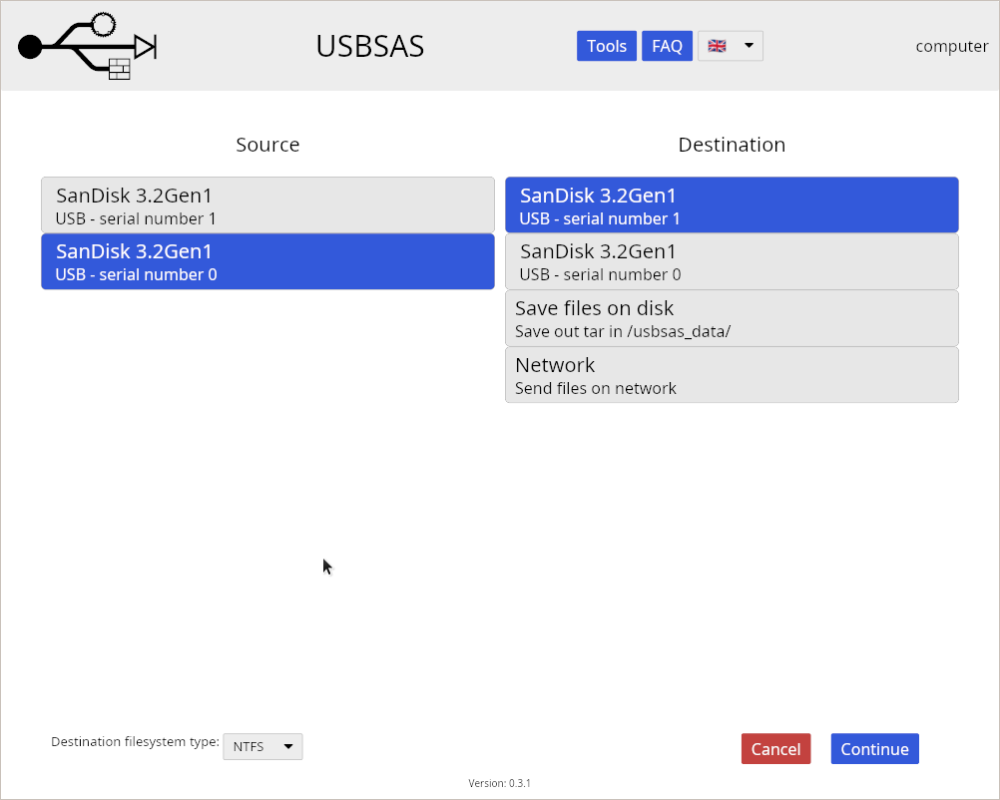

---

### Optionally, the format of the output filesystem can be changed

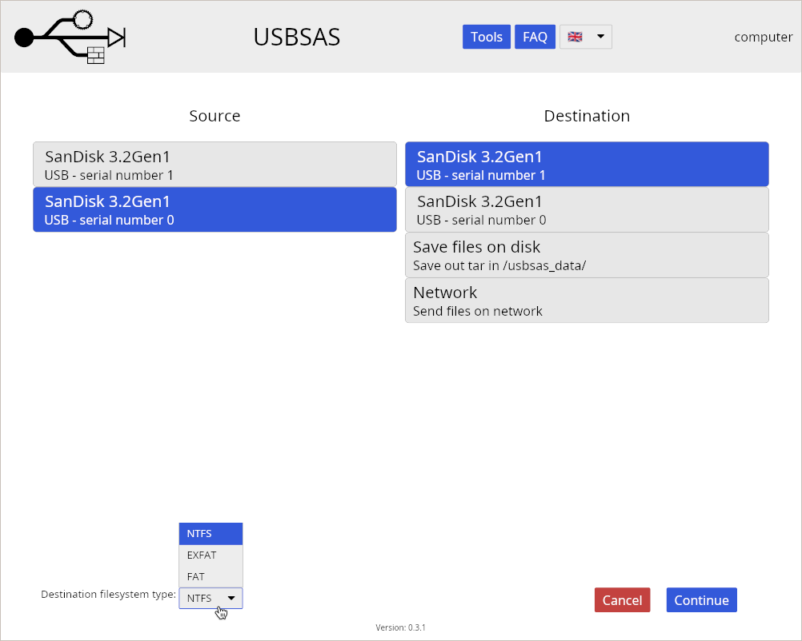

---

### Partition selection if more than one is present on the input device

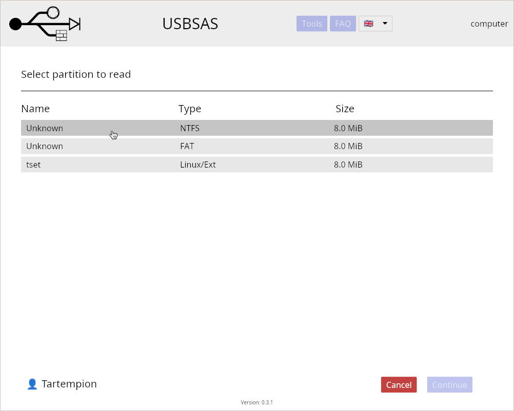

---

### Input device file listing

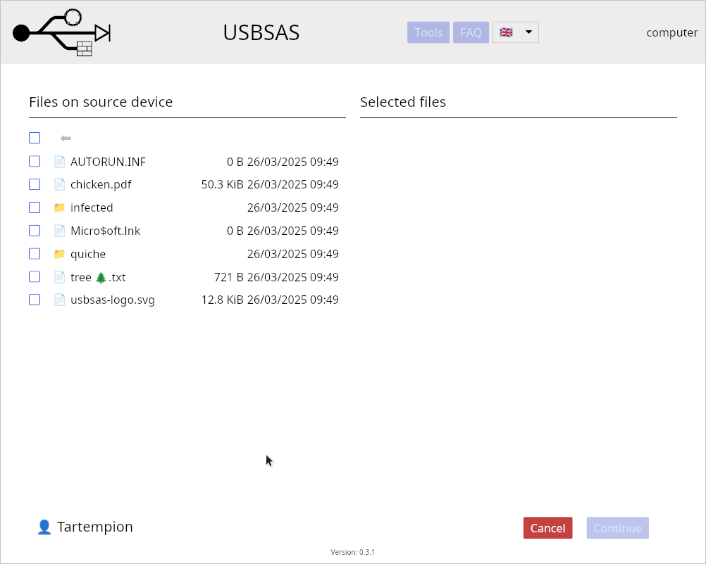

---

### File selection

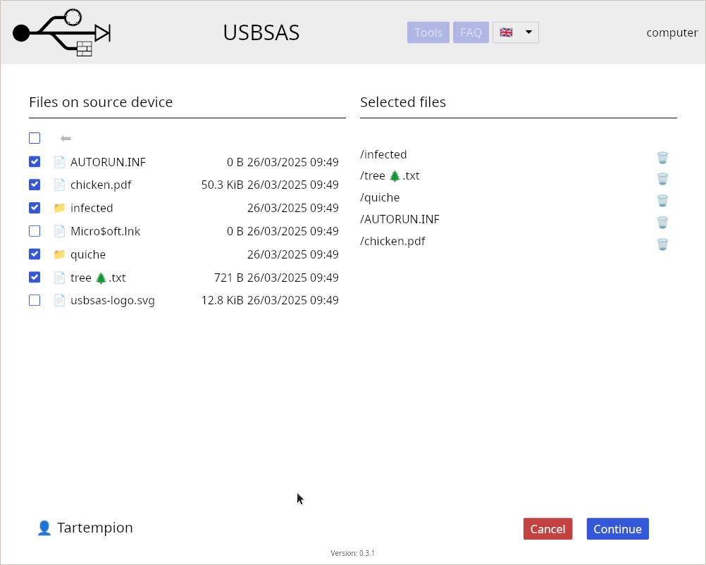

---

### Files transfer

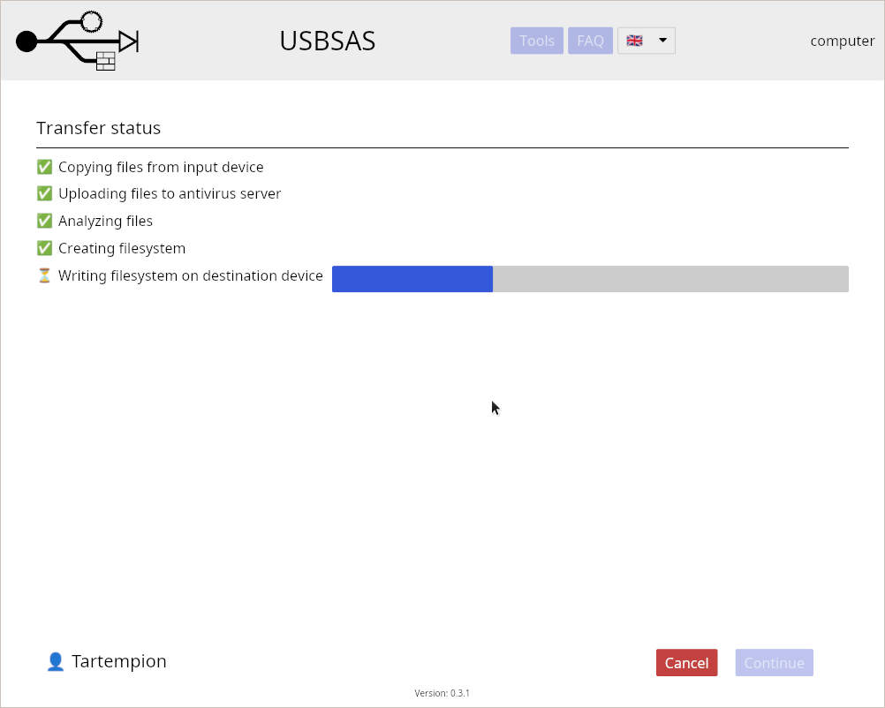

---

### Report display

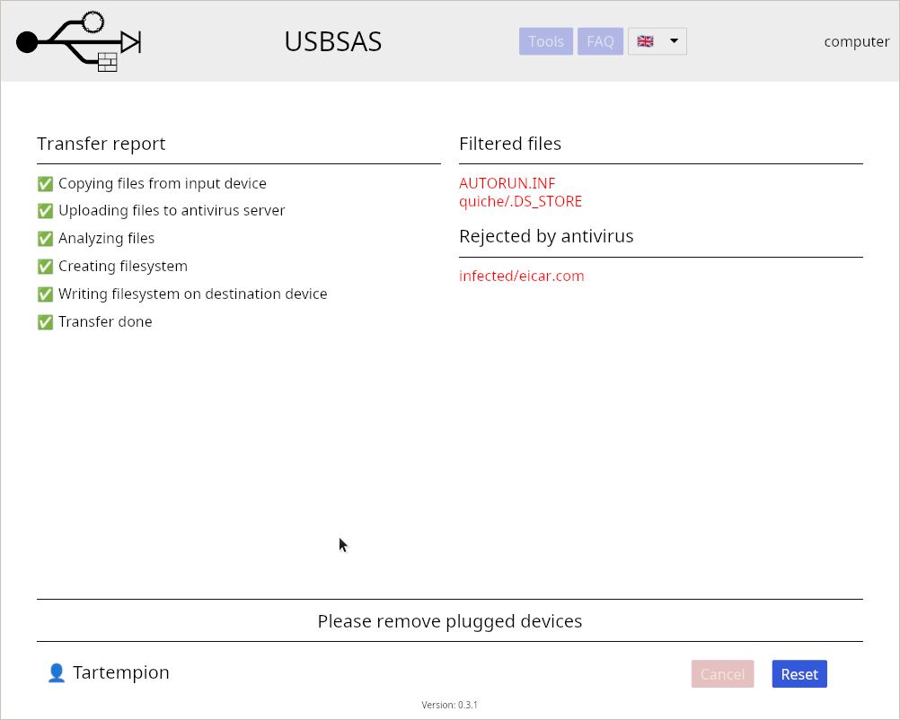

---

### Tools

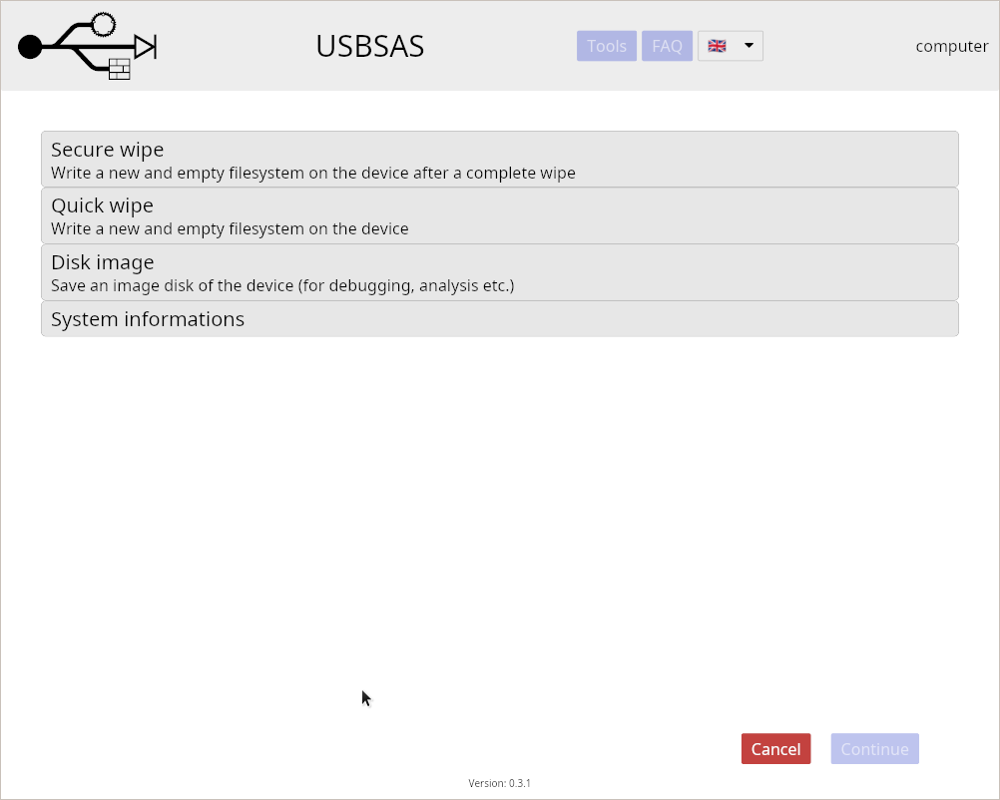

---

### Device wipe

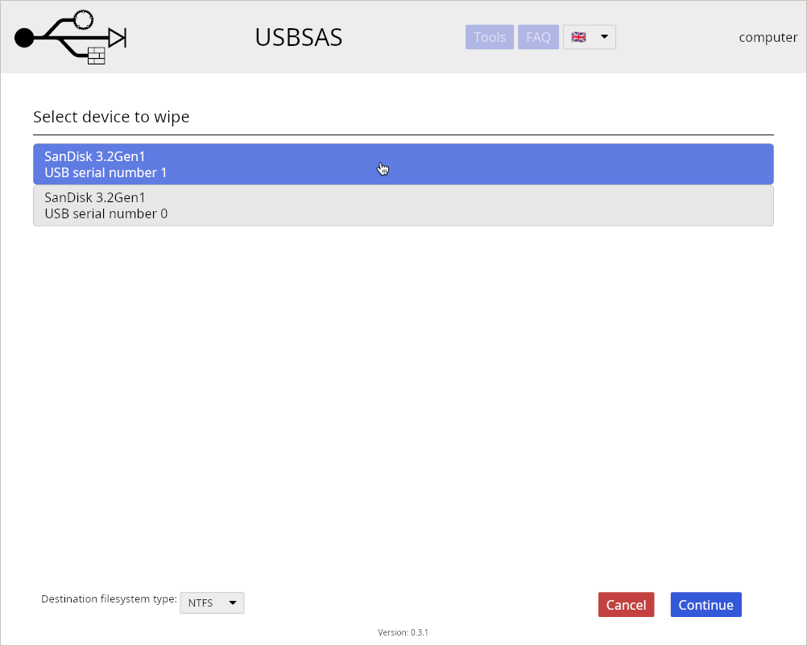

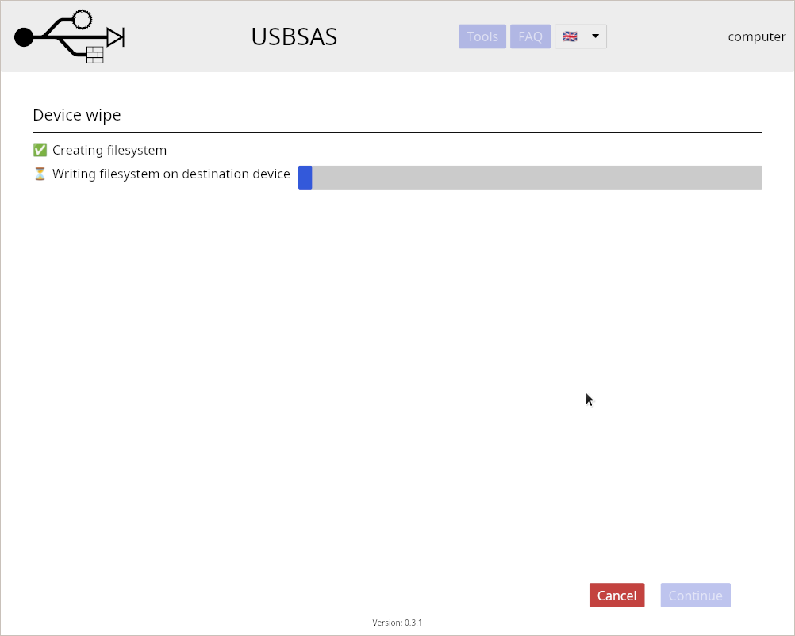

